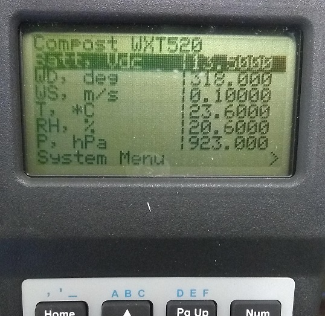

# Compost WXT520 Logger Program

Simple data acquisition from Vaisala [WXT520](https://www.campbellsci.com/wxt520)
using a Campbell Scientific [CR1000](https://www.campbellsci.com/cr1000). 

## Wiring

The CR1000 is powered from a 12V power supply w/ charging regulator 
([PS200](https://www.campbellsci.com/ps200), Campbell Scientific) and a 7AH gel
cell battery. A 20W solar panel recharges the system.

### WXT520 

> *See manufacturer (not vendor) user manual for correct color identification.*

| Description          | Color        | CR1000 |
|----------------------|--------------|:------:|
| power input          | brown        | 12V |
| power ground         | red          | G |
| SDI-12 data signals  | blue & white | C1 |
| SDI-12 ground        | green        | G |
| (opt.) heater power  | yellow       | - |
| (opt.) heater ground | pink         | - |
| *not used*           | gray         | - |

## Operation

### To deploy the unit

1. Mount WXT520 oriented to True North; see user manuals under References below
2. Connect power/data cable to WXT520
3. Turn the PS200 power switch to *ON*

### To monitor in real time

Press any key to wake the keyboard display. Summary values are displayed on
the default screen.

### To collect data

1. Unscrew and open the memory card cover
2. Press the large white "Removal button"
3. Press the black push tab to eject memory card
4. Insert new blank memory card
5. Close and secure memory card cover

## Data Products

The weather station internally produces 1-minute average values and the logger
samples those values at the start of each minute. A single data file is written
to CompactFlash memory card:

* Base name: `compost_WXT520`
* Record interval: 5 minutes
* Number of records: approximately 90 days on external memory card (up to 230
  days internal storage)
* Fill-stop settings: "ring" mode - overwrites oldest records when card is full

| Field name         | Units   | Description |
|--------------------|---------|-------------|
| power_in_Avg       | Vdc     | Battery voltage |
| WindSpeed_sclr_Avg | m/s     | Mean horizontal wind speed |
| WindSpeed_rslt_Avg | m/s     | Mean wind vector magnitude |
| WindDir_rslt_Avg   | degrees | Resultant mean wind direction |
| WindDir_sclr_Avg   | degrees | Standard deviation of wind direction calculated using Campbell Scientific's wind speed weighted algorithm (not recommended for straight-line Gaussian dispersion models, but OK for variable-trajectory transport models [ref](#ref1)) |
| Tmpr_Avg           | ºC      | Mean air temperature |
| RH_Avg             | %       | Mean relative humidity |
| Press_Avg          | hPa     | Mean barometric pressure |
| R_amt_Avg          | mm      | Mean rain amount |
| R_dur_Avg          | sec     | Mean rain duration |
| R_int_Avg          | mm/hr   | Mean rain intensity |
| WindSpeed_min_Avg  | m/s     | Mean minimum wind speed |
| WindSpeed_avg_Avg  | m/s     | Mean average wind speed |
| WindSpeed_max_Avg  | m/s     | Mean maximum wind speed |
| WindDir_min_Avg    | degrees | ^Mean minimum wind direction |
| WindDir_avg_Avg    | degrees | ^Mean average wind direction |
| WindDir_max_Avg    | degrees | ^Mean maximum wind direction |

**Notes:**
* **^** value is dubious

## Configuration Summary

> *I had a hard time locating a working copy of the manufacturer configuration
> tool and also was unable to get an instrument response using the service port
> and a serial terminal (RealTerm). Instead, use the CR1000's internal serial
> terminal to verify program settings. Hopefully it's already in SDI-12!*

* Communications: 
    * Address: 0
    * Protocol: SDI-12 continuous (`aXU,M=S`)
    * No repeated Composite data messages (`aXU,I=0`)
* Wind sensor:
    * Parameters: all of them (`aXWU,R=1111110011111100`)
    * Update interval: 60 seconds
    * Averaging time: 60 seconds
    * Min/max mode: traditional
    * Speed unit: m/s
    * Direction offset: 0 degrees
    * Sampling rate: 4 Hz
* Press/Tmpr/RH sensors:
    * Parameters: 1st (Pa), 2nd (Ta) and 4th (Ua) bits
    * Update interval: 60 seconds
    * Pressure unit: hPa (mbar)
    * Temperature unit: Celsius
* Precipitation sensor:
    * Parameters: first 6 (all but Rain peak and Hail peak)
    * Update interval: 60 seconds
    * Precip units: metric
    * Hail units: metric
    * Autosend mode: *n/a for SDI-12*
    * Counter reset: manual (default?)

## Licensing

This software was developed by Patrick O'Keeffe for the [Department of Animal
Sciences](https://ansci.wsu.edu) at WSU. This software is released under the terms of
[The MIT License](https://opensource.org/licenses/MIT). 

## References

* <a name="ref1">Campbell Scientific. *CRBasic Program Reference: WindVector*. CR1000.Std.32.03.

* Campbell Scientific. *WXT520 Weather Transmitter Instruction Manual.*
  Retrieved [2019-04-01](http://web.archive.org/web/20190402022924/https://s.campbellsci.com/documents/us/manuals/wxt520.pdf).
  Online: https://s.campbellsci.com/documents/us/manuals/wxt520.pdf

* O'Keeffe, Patrick. *Long-term Trace Gas Flux Sampler.* Retrieved
  [2019-04-01](https://github.com/patricktokeeffe/smart-rea-sampler/tree/28761e29de800241bed19b0f57ce3843934bad00).
  Online: https://github.com/patricktokeeffe/smart-rea-sampler

* Vaisala Oyj. *Vaisala Weather Transmitter WXT520 User's Guide.* Retrieved
  [2019-04-01](http://web.archive.org/web/20190402023101/https://www.vaisala.com/sites/default/files/documents/M210906EN-C.pdf).
  Online: https://www.vaisala.com/sites/default/files/documents/M210906EN-C.pdf

